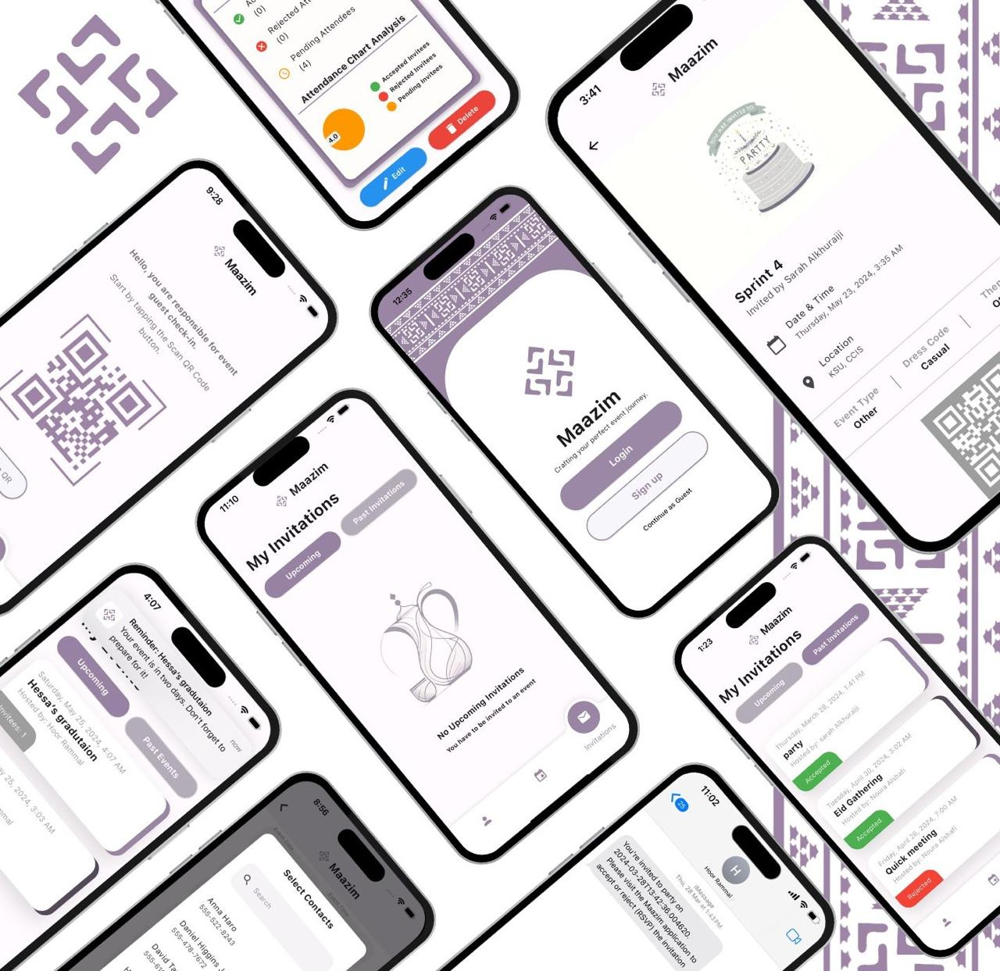

# 📲 Maazim – Digital Event Management App

**Maazim** is a mobile application developed to revolutionize the traditional event invitation process by providing a secure, efficient, and eco-friendly alternative. The app enables event organizers to create and send personalized invitations, manage guest lists, and facilitate smooth guest entry using QR code scanning.

> 🔒 This repository serves as a public showcase. The full source code is hosted privately.

---

## 🔗 Live Demo

- 🎥 [Video Demo](https://drive.google.com/drive/folders/1axU-AwVmvDp_Xm9sGVZvDjJ4ZP-lPyfa)

---

## 📱 Platform
- iOS (developed with Flutter)
- Backend: Firebase (Firestore, Authentication, Cloud Functions)

---

## 🎯 Project Scope
Maazim addresses common event management challenges, including:
- Lost or misdirected invitations
- Manual RSVP tracking
- Entry verification issues
- Environmental impact of printed invites

---

## 🎯 Project Goals
- Implement secure and efficient digital invitation management
- Ensure reliable guest verification at events
- Enhance the guest experience with a user-friendly design
- Support eco-friendly, paperless event planning

---

## ✨ Core Features
- Send personalized, trackable digital invitations
- Guest RSVP management
- QR code generation and scanning for secure entry
- Real-time data updates using Firebase
- Calendar and map integration for guests
- Multi-role support: Host, Guest, Entry Coordinator

---

## 🛠️ Tech Stack
- **Frontend**: Flutter (Dart)
- **Backend**: Firebase Firestore, Firebase Auth
- **Development Tools**: 
  - Visual Studio Code
  - Xcode (Simulator)
  - GitHub (Version control)
- **Project Management**: Trello, Google Drive

---

## 👤 My Role – Team Lead & Developer

As the **project leader**, I was responsible for managing the project timeline, task delegation, technical direction, and implementation of critical features. My work spanned across frontend, backend, and system design, with a focus on stability, usability, and secure user flows.

### 🔧 Setup & Configuration
- Configured the development environment (Flutter, Firebase, GitHub)
- Established CI-friendly workflows and structured the project repository

### 🔐 Authentication & Security
- Developed Firebase Authentication with email/password and OTP login
- Implemented secure password reset logic using Firebase OTP and links

### 📲 Features I Personally Built
- **Host Journey**:
  - Event creation (title, date, time, location, invitees)
  - Viewing current and past events
  - Deleting accounts securely
  - Contacting Maazim support
  - Google Maps integration for event locations

- **Guest Journey**:
  - OTP-based sign-in
  - View invitations and event details
  - Logout and session management

- **System Integrations**:
  - SMS OTP delivery
  - Triggered actions via Firebase Functions

### 🧪 Testing & QA
- Led testing of all major user flows (guest, host, entry coordinator)
- Verified edge cases: account deletion, role-based access, password recovery

---

## 🏛 Acknowledgments

Grateful to my team and instructors for their collaboration.

---

## 📬 Contact

For questions or collaboration:
- GitHub: [https://github.com/sarah1kh](https://github.com/sarah1kh)
- LinkedIn: [https://www.linkedin.com/in/sarah-alkhuraiji1/](https://www.linkedin.com/in/sarah-alkhuraiji1/)

---

 
